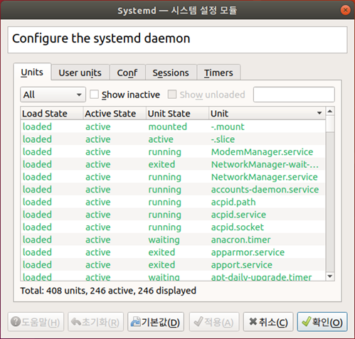

# 데몬(demon)
OS에서 해당 서비스를 제공해주려고 대기중인 모듈

## 데몬이란?
데몬은 메모리에 머무르고 있으면서, 특정 요청이 오면 바로 그에 대한 대응을 할 수 있도록 항상 대기중인 프로세스를 말한다.

대표적인 데몬으로는 다음과 같은 것들이 있다.
* Network daemon
* web server daemon 등등

## 특징
데몬들의 명칭에는 보통 `Daemon`을 뜻하는 `d`를 이름 끝에 달고 있것이 특징이다.
예를 들면 `httpd` 는 아파치의 `http`와 데몬의 `d`를 합친 이름의 웹서버 데몬을 뜻한다.

## 데몬의 실행
리눅스에서 데몬을 실행하는 방법은 크게 2가지 입니다.
* standalone type daemon
* inetd type daemon

### standalone
독립적으로 실행됩니다. 요청에 의해 실행되기 때문에 메모리에 항상 대기하는 데몬 방식이다. 따라서 요청에 대한 응답속도가 빠르지만, 항상 백그라운드에서 대기해야하므로 메모리 효율이 좋지 않다.

### inetd
Super Daemon이라는 특별한 데몬에 의해 간접적으로 실행되는 데몬이다. 
사용자에 의한 요청이 발생할 경우, xinetd 프로그램이 해당 요청을 분석하여 필요한 데몬을 메모리에서 실행하여 응답하는 방식이다. standalone방식보다 응답속도가 느리지만, 메모리 효율은 그에 비해 훨씬 좋다. 따라서 매우 빠른 응답속도가 필요하지 않을 경우에 사용한다.

Ubuntu에서는 기본적으로 Super daemon이 설치되지 않기에 Package Manager를 통해 설치해줘야 한다.
```bash
sudo apt install netkit-inetd
```


## 서비스 설정

### 서비스란? 
서비스(데몬) 설정 - 서비스(데몬)의 시작, 중지, 재시작 및 사용 여부 설정
* command

```
$ systemctl status/restart/stop/start 서비스 이름
```


* GUI환경

```
$ sudo apt install kde-cli-tools kde-config-systemd
$ kcmshell5 kcm_systemd

```





