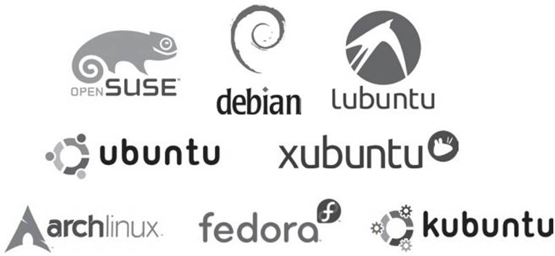

# 리눅스 배포본
리눅스는 다양한 배포판(distribution)이 존재합니다. 이러한 배포판은 서로 다른 특징과 용도를 가지고 있으며, 사용자들은 자신의 필요에 맞게 선택할 수 있습니다.

## 배포판의 구분
일반적으로는 다음과 같은 기준으로 리눅스 `배포판`을 구분합니다.

### 패키지 관리 방식
* Debian 계열 : apt-get, aptitude
* Red Hat 계열 : yum, dnf

### 사용자 인터페이스(UI)
* CLI(Command Line Interface) : 콘솔 환경
* GUI(Graphical User Interface) : X 윈도우 시스템, GNOME, KDE 등

### 사용 용도
* 서버(Server)용 : CentOS, Debian, Ubuntu Server 등
* 데스크탑(Desktop)용 : Ubuntu, Fedora, openSUSE 등
* 임베디드(Embedded)용 : Angstrom, OpenWrt 등

### 커널(Kernel) 버전
* 2.4.x : Red Hat Enterprise Linux 3, Debian 3.0 등
* 2.6.x : CentOS 6, Ubuntu 10.04 등
* 3.x 이상 : CentOS 7, Ubuntu 16.04 등
각 배포판은 자체적으로 패키지 관리자, 시스템 설정 도구 등을 제공하며, 사용자는 이러한 기능을 이용하여 적절한 배포판을 선택하고 사용할 수 있습니다.

## 배포판의 종류
대표적인 리눅스 배포판

### RedHat

### ASPLinux
ASPLinux는 러시아에서 개발된 리눅스 배포판 중 하나입니다. 2000년대 초반에 출시되어 기업 및 개인 사용자들에게 널리 사용되었습니다.

### CentOS

### Ubuntu
우분투는 데비안 계열의 리눅스 배포본이다.
배포판은 전 세계적으로 수백 가지가 넘지만 모두 `토르발스`가 제작한 커널을 사용하며 대표적인 것이 우분투 리눅스

### 슬랙웨어

## 유상 배포하는 리눅스
* 기업의 경우 유지보수와 패키지 추가 지원을 위하여 서비스 비용을 내고 사용
* Ex) Redhat linux

