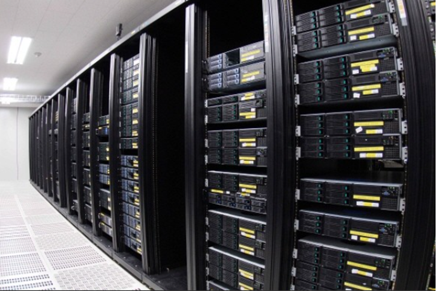

# Linux
리눅스는 컴퓨터 운영체제 중 하나로, 다중 사용자 및 다중 작업 환경을 지원하며, 안정성, 보안성, 이식성 등의 특징을 가지고 있습니다.   

### 리눅스의 탄생 
리눅스의 탄생은 1991년 핀란드의 대학생 리누스 토발즈가 개발한 커널에서 시작되었습니다. 당시 리눅스 토발즈는 마이크로소프트사의 윈도우 운영체제에 대한 불만을 가지고 있었고, 또한 유닉스 계열 운영체제에 대한 높은 비용 문제도 인식하고 있었습니다. 그래서 자신이 만든 커널에 유닉스와 비슷한 명령어 인터페이스와 기능을 구현하여, 공개 소프트웨어로 배포하기 시작했습니다.  

### 오픈소스
오픈 소스 개발자들이 리눅스 커널을 개발하고, 리눅스 운영체제가 발전해 나가게 되었습니다. 현재 리눅스는 오픈 소스 운영체제 중 하나로, 안정적이고 보안성이 높아서 서버나 임베디드 시스템 등 다양한 분야에서 사용되고 있습니다. 또한, 다양한 배포판과 애플리케이션들이 개발되어 있어, 개인용 컴퓨터에서도 사용할 수 있습니다.

* 프로그램 소스코드를 무료로 공개하여 사용자는 원하는 대로 특정 기능을 추가함
- 1992년에 0.02 버전을 내놓으면서 인터넷에 소스코드를 `공개`, 이것이 리눅스의 시초

### 특징
* 어느 플랫폼에도 포팅이 가능함
* 현재는 개인 PC, 기업의 중대형 컴퓨터, 임베디드 기기, 모바일 기기에서도 리눅스가 동작

