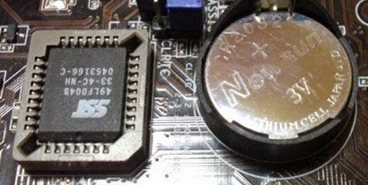
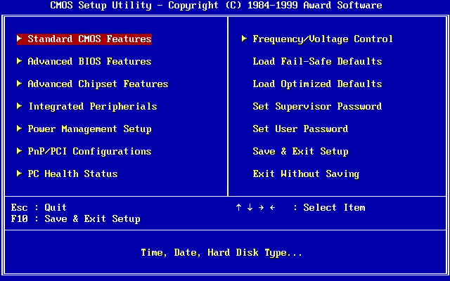

# 컴퓨터의 Bios
BIOS는 `Basic Input/Output System`의 약어로, 컴퓨터의 기본 입출력을 제어하는 `펌웨어`입니다.   

## 컴퓨터의 시작 부팅
컴퓨터가 `부팅`될 때 `BIOS가 먼저 실행`되며, 하드웨어를 `초기화`하고 운영체제를 `로드`합니다. BIOS는 컴퓨터가 제대로 동작하기 위해 필요한 초기 설정 정보를 가지고 있으며, 이 정보는 `CMOS` 메모리에 저장됩니다.  

## 운영체제와 BIOS
운영체제는 BIOS와는 다릅니다. 운영체제는 컴퓨터 시스템의 핵심 요소 중 하나로, 하드웨어와 소프트웨어 사이에서 중개자 역할을 수행합니다. 운영체제는 컴퓨터 자원(하드웨어와 소프트웨어)을 효율적으로 관리하여 사용자가 프로그램을 쉽게 실행하고 작업할 수 있도록 합니다.

> 출처: https://ko.wikipedia.org/wiki/%EB%B0%94%EC%9D%B4%EC%98%A4%EC%8A%A4

BIOS와 운영체제의 가장 큰 차이점은 기능과 `역할`입니다. BIOS는 컴퓨터의 하드웨어 `초기화`와 `부팅 프로세스`를 관리하며, 운영체제는 `하드웨어`와 `소프트웨어`를 `관리`하여 사용자가 프로그램을 `실행`하고 작업할 수 있도록 합니다.  

또한, BIOS는 컴퓨터가 부팅될 때 `자동으로 실행`되지만, 운영체제는 사용자가 명령을 입력하거나 프로그램을 실행할 때에만 실행됩니다.