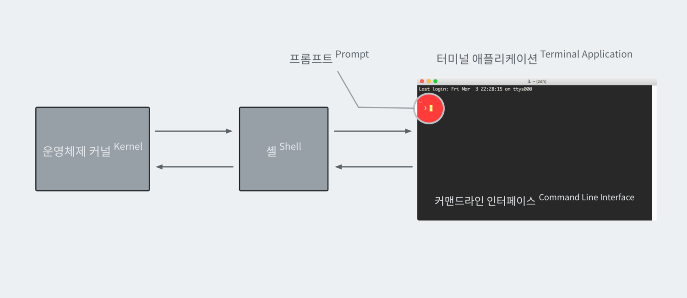
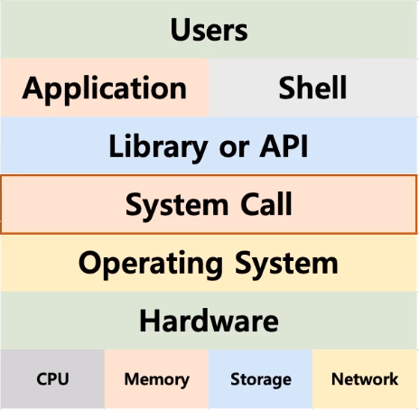

# 인터페이스
컴퓨터 운영체제에서 인터페이스(Interface)란, 컴퓨터 시스템과 사용자 또는 응용 프로그램 간의 상호작용을 가능하게 하는 수단입니다. 운영체제의 인터페이스는 일반적으로 사용자가 시스템과 상호작용하는 방식을 정의하며, 시스템의 기능을 사용하고 다룰 수 있는 방법을 제공합니다.

## CLI  
운영체제에서 제공하는 인터페이스는 크게 명령 줄 인터페이스(Command Line Interface, CLI)와 그래픽 사용자 인터페이스(Graphical User Interface, GUI)로 구분됩니다.  

> 출처 : https://www.44bits.io/ko/keyword/command-line-interface-cli-shell-and-terminal

명령 줄 인터페이스는 텍스트 기반으로 사용자가 키보드를 통해 명령어를 입력하여 시스템과 상호작용합니다. 이는 프로그래밍 작업 등에 유용하며, 일부 사용자는 보다 빠른 작업을 위해 CLI를 선호합니다.

## GUI  
그래픽 사용자 인터페이스는 마우스, 키보드 등을 사용하여 그래픽 요소로 구성된 창, 버튼, 아이콘 등을 통해 사용자가 시스템과 상호작용하는 방식입니다. GUI는 일반적으로 보다 직관적이고 사용하기 쉽지만, 자원 소모가 많아질 수 있습니다.  

> 출처: https://m.blog.naver.com/PostView.naver?isHttpsRedirect=true&blogId=vinylx&logNo=220004281856

## API  
운영체제는 또한 응용 프로그램 간의 상호작용을 위한 인터페이스도 제공합니다. 이를 API(Application Programming Interface)라고 부르며, 응용 프로그램 개발자는 API를 사용하여 다른 프로그램과 상호작용할 수 있습니다.

> 출처: https://dodonam.tistory.com/101