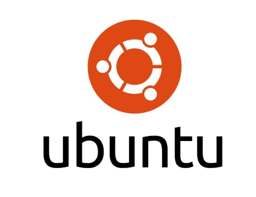
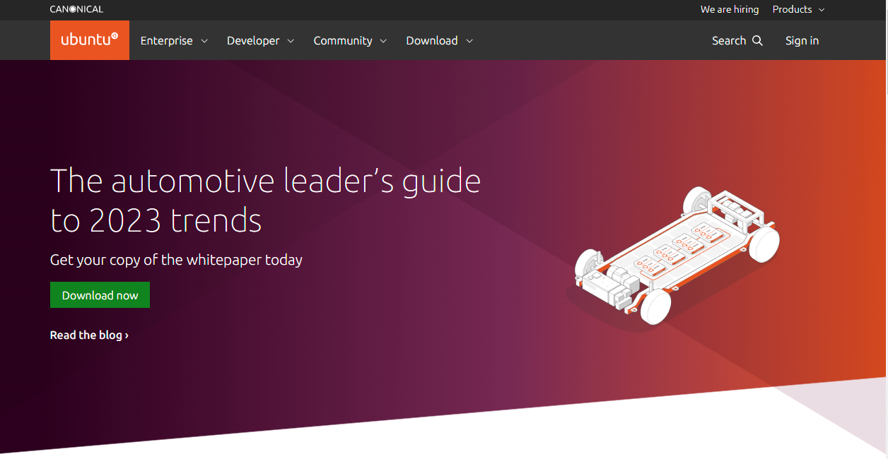

# ubuntu 설치하기
---
우분투를 설치하기 위해서는 먼저 미디어를 다운로드 받고, 컴퓨터 또는 가상머신에 설치를 해야 합니다.

## 우분투 리눅스란
우분투 리눅스는 무료 및 오픈 소스 기반의 리눅스 운영체제로, 쉬운 사용성과 다양한 패키지 지원으로 인기가 높은 배포판입니다.


 ‘Ubuntu’는 남아프리카 어느 부족의 말로, ‘너가 있으니 나도 있다’라는 뜻





우분투 리눅스는 데비안 리눅스에서 파생되었으며, 데비안의 안정성과 신뢰성을 계승하면서도, 사용자 친화적이고 쉬운 인터페이스를 제공합니다. 또한, 커뮤니티의 기여도가 높아서 다양한 소프트웨어와 패키지를 지원하며, 영어뿐만 아니라 다양한 언어로 번역되어 있어 전 세계에서 사용되고 있습니다.  


우분투 리눅스는 무료로 제공되며, 사용자들이 원하는 대부분의 소프트웨어 및 패키지를 설치하고 사용할 수 있습니다. 또한, 디스크 이미지 파일인 ISO 파일을 다운로드하여 CD, DVD 또는 USB 드라이브 등에 복사하여 사용할 수 있습니다. 우분투 리눅스는 서버용, 데스크톱용, 모바일용 등 다양한 버전이 제공되고 있으며, 많은 사용자들에게 인기를 얻고 있습니다.    


### Canonical

우분투 리눅스는 Canonical Ltd.가 개발하고 배포하고 있는 리눅스 배포판입니다. Canonical은 2004년 Mark Shuttleworth가 설립한 개발 회사로, 우분투 리눅스를 비롯한 다양한 오픈 소스 프로젝트를 개발하고 있습니다.

Canonical은 우분투 리눅스와 관련된 다양한 서비스와 제품을 제공하고 있으며, 이를 통해 기업용 서버, 클라우드, 인터넷 물건들의 플랫폼(IoT), 모바일 기기용 운영체제 등을 지원하고 있습니다. 또한, Canonical은 서비스 지원과 상업용 제품 등을 제공하여 사용자들의 운영체제 관리를 도와주고 있습니다. 

Canonical은 오픈 소스 커뮤니티와 함께 우분투 리눅스를 발전시켜 나가고 있으며, 사용자들에게 안정적이고 신뢰성 있는 운영체제를 제공하기 위해 노력하고 있습니다.


### 배포정책

우분투 리눅스는 데스크톱과 서버용으로 두 가지 버전이 제공되고 있으며, 데스크톱 버전은 GNOME 데스크톱 환경을 기본으로 제공합니다.  


우분투는 데스크톱, 서버, 클라우드, IoT 등 다양한 분야에 맞는 버전을 제공하고 있습니다. 또한, 일반적으로 새로운 버전을 6개월마다 출시하며, 장기 지원(lts) 버전도 제공됩니다. 장기 지원 버전은 보안 업데이트 및 기술 지원 등을 최소 5년간 제공하므로, 기업 및 서버 환경에서 많이 사용됩니다.  


우분투는 무료로 다운로드 및 사용이 가능하며, 다양한 소프트웨어 및 패키지도 무료로 제공됩니다. 또한, Canonical에서는 우분투 리눅스와 관련된 다양한 상용 제품과 서비스를 제공하고 있으며, 이를 통해 기업 고객들의 요구에 맞게 지원해 나가고 있습니다.


### 우분투 버젼

우분투 리눅스는 2004년 Mark Shuttleworth가 개발한 무료 및 오픈 소스 리눅스 배포판으로 출시되었습니다. 그리고 6개월마다 새로운 버전을 출시하는 정책을 가지고 있어, 매년 4월과 10월에 새로운 버전이 출시되고 있습니다. 

우분투는 정식 릴리스 버전 외에도 데일리 빌드, 베타 버전, RC(릴리즈 후보) 버전 등을 제공하며, 이를 통해 개발자와 사용자들이 최신 기술을 적용한 운영체제를 미리 체험하고 테스트할 수 있습니다. 또한 우분투는 Long Term Support (LTS) 버전을 제공하여, 해당 버전은 최소 5년간 보안 업데이트와 기술 지원을 제공합니다. 이러한 배포 정책은 우분투의 안정성과 신뢰성을 높여주는 요인 중 하나입니다.


우분투 리눅스 버전 주기

* 일반 버전은 약 6개월마다, LTS(장기, 5년) 버전은 2년마다 새로운 버전 발표

> Ex) 우분투 15.10 - 2015년 10월에 발표한 일반 버전, 우분투 18.04 LTS - 2018년 4월에 발표한 장기 지원 버전


### 데비안 리눅스와 우분투 리눅스 

데비안 리눅스

* 유명한 리눅스 배포판 중 하나이며 1993년에 이언 머독(Ian Murdock)이 창시한 데비안 프로 젝트(Debian Project)에서 제작

* 데비안 리눅스의 정식 버전은 1996년 1.1 버전(코드명 Buzz)으로 시작, 2019년 10 버전 발표

* 패키지의 설치와 업그레이드가 상당히 단순하고 apt 프로그램을 이용하여 소프트웨어 설치 나 업데이트가 자동으로 진행됨


우분투 리눅스

* 데비안 리눅스를 기초로 유니티(unity) 데스크톱 환경을 사용하는 리눅스 배포판

* 첫 버전을 출시한 이후 계속 업그레이드됨, 인기 리눅스 배포판 중 하나

* 기본적으로 우분투 데스크톱과 우분투 서버를 배포

* 쿠분투(Kubuntu), 우분투 킬린(Ubuntu Kylin), 루분투(Lubuntu), 주분투(Xubuntu) 등 다양한 배포판 개발, 이를 통틀어 ‘우분투 플레이버스(Ubuntu flavours)’라고 부름


## 설치 미디어
---
새롭게 우분투를 설치하기 위해서 iso 이미지를 다운로드 받습니다.




* [우분투 설치 미디어 만들기](iso)  


## 베어메탈 서버설치
리눅스 베어메탈 설치란, 가상화 기술을 사용하지 않고 물리적인 서버 하드웨어에 직접 리눅스 운영체제를 설치하는 것을 말합니다. 이는 가상화된 환경에서 발생할 수 있는 오버헤드를 줄이고, 더욱 안정적인 성능을 제공할 수 있다는 장점이 있습니다. 또한, 베어메탈 설치는 하이퍼바이저를 거치지 않으므로 보안성이 더 높고, 하드웨어와 직접적으로 연결되므로 성능적으로 우수합니다. 하지만 하드웨어를 직접적으로 다루기 때문에 적절한 전문 기술과 경험이 필요합니다.  

* [설치 디스크 생성](iso)

* 컴퓨터 바이오스에서 USB로 부팅하여 설치를 실행합니다.  
* 물리적 컴퓨터에 우분투를 설치합니다.


## 데스크탑 가상머신
데스크탑 가상머신(Desktop Virtualization)은 호스트 컴퓨터에서 가상의 컴퓨터 환경을 만들어서 여러 운영체제를 실행하는 기술입니다. 이를 통해 호스트 컴퓨터에서 다수의 운영체제를 실행할 수 있어, 하나의 물리적인 컴퓨터에서 여러 개의 가상 머신을 운용할 수 있습니다. 이는 물리적인 하드웨어 자원을 효율적으로 사용할 수 있고, 다양한 운영체제 및 응용 프로그램을 테스트하고 개발할 수 있어 개발자나 IT 관리자들 사이에서 널리 사용됩니다. 대표적인 데스크탑 가상머신 소프트웨어로는 VMWare, VirtualBox, Hyper-V 등이 있습니다.  


* 새로운 가상머신을 하나 생성합니다.
* 다운로드 받은 iso 파일을 가상 CD-ROM에 연결하여 부팅을 합니다.


### 가상머신의 종류

* virtualbox
* vmware


데스크탑 가상머신을 사용하는 장점은 다음과 같습니다.

1. 하나의 물리적인 컴퓨터에서 여러 개의 운영체제를 실행할 수 있으므로, 하나의 컴퓨터로 다양한 운영체제를 경험하거나 테스트할 수 있습니다.
2. 물리적인 하드웨어 자원을 효율적으로 사용할 수 있어, 비용이 절감될 수 있습니다.
3. 가상머신은 물리적인 컴퓨터와 격리된 환경에서 실행되므로, 보안과 안정성이 향상됩니다.
4. 다양한 응용 프로그램을 실행할 수 있어, 개발자나 IT 관리자들에게는 소프트웨어 테스트 및 배포 시간을 줄일 수 있습니다.

하지만 데스크탑 가상머신을 사용하는 경우에는 다음과 같은 단점도 있습니다.

1. 가상머신은 호스트 시스템에서 실행되므로, 호스트 시스템의 성능에 따라 가상머신 성능이 제한될 수 있습니다.
2. 하나의 물리적인 컴퓨터에서 여러 개의 운영체제를 실행하므로, 가상머신 자체의 오버헤드가 발생할 수 있습니다.
3. 가상머신을 사용하는 경우, 물리적인 하드웨어와의 호환성 문제가 발생할 수 있습니다.


## 우분투 설치 진행하기


### 우분투 설치에 필요한 하드웨어

최소 혹은 권장 하드웨어 사양

* CPU: 2GB 이상의 듀얼코어 프로세서

* 하드디스크의 여유 공간: 25GB 이상(추가 설치에 따라서 달라질 수 있음)

* 메모리: 2GB 이상

* 그래픽 카드: 1024×768 이상의 해상도 지원


## 설치후 확인하기
---
우분투가 정상적으로 설치가 되었는지 콘솔 명령을 통하여 확인합니다.

###  버젼 확인하기
방법1
```bash
hojin@hojin1:~$ cat /etc/issue
Ubuntu 20.04 LTS \n \l
```

방법2
```bash
hojin@hojin1:~$ lsb_release -a
No LSB modules are available.
Distributor ID: Ubuntu
Description:    Ubuntu 20.04 LTS
Release:        20.04
Codename:       focal
```

### 배포판 버젼 확인
설치된 우분투의 버젼을 확인합니다.

```bash
grep . /etc/*-release
```