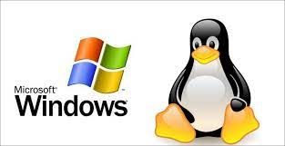

# WSL (windows Subsystem Linux)
개발용 컴퓨터로 MacOS를 많이 사용합니다.  
대안으로 Linux운영체제가 있지만, 다양한 응용프로그램과 사용을 같이 할 수 없다는 단점이 있습니다.

wsl은 윈도우에서 Ruby, Python, PHP, NodeJS와 같은 개발환경의 복잡함을 보다 쉽게 개선하기 위한 리눅스 오픈소스 환경입니다.   

## WSL의 탄생
WSL(Windows Subsystem for Linux)은 Windows 운영 체제에서 네이티브 Linux 환경을 실행할 수 있는 기술입니다. WSL은 Microsoft가 개발한 기술로, Windows 10 Anniversary Update부터 처음 도입되었습니다.

WSL의 탄생 배경에는 몇 가지 이유가 있습니다. 첫째, 개발자들이 Linux 환경에서 개발을 하는 것이 늘어나면서, Windows 사용자도 Linux 환경을 사용하고자 하는 요구가 늘어나고 있었습니다. 둘째, 기업에서는 Windows 환경에서 개발하는 것이 일반적이지만, 일부 프로젝트에서는 Linux 환경에서 개발을 해야 했습니다. 따라서, 개발자들은 Windows와 Linux 환경을 번갈아가며 사용해야 했습니다.

이러한 요구를 반영하여, Microsoft는 WSL을 개발하게 되었습니다. WSL은 Windows 환경에서 Linux 명령을 실행할 수 있도록 하여, Windows 사용자가 Linux 환경에서 개발하는 것과 유사한 경험을 제공합니다. 또한, WSL을 이용하면 Windows와 Linux를 번갈아가며 사용하는 것이 아니라, Windows 환경에서 Linux 환경을 통합하여 사용할 수 있습니다.

WSL은 Linux 환경을 가상화하는 것이 아니라, Windows와 Linux 커널 간의 상호 운용성을 제공함으로써 더욱 빠르고 안정적인 Linux 환경을 제공합니다. 또한, WSL을 통해 Windows에서 Linux 프로그램을 실행할 수 있으므로, 개발자들은 Windows에서도 Linux에서 사용하는 도구들을 사용할 수 있습니다.

