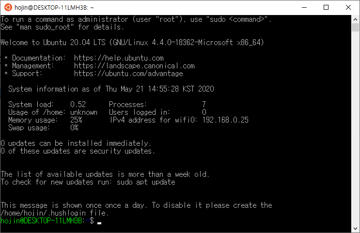

# WSL 설치

## WSL Ubuntu란
> 정리과제

## 설치 가능한 배포본 확인
마이크로소프트는 다양한 종류의 wsl용 리눅스를 제공합니다. 다음과 같이 설치 가능한 배포본의 목록을 확인합니다.

```bash
C:\Users\infoh>wsl -l -o
다음은 설치할 수 있는 유효한 배포판 목록입니다.
'wsl.exe --install <Distro>'를 사용하여 설치합니다.

NAME                                   FRIENDLY NAME
Ubuntu                                 Ubuntu
Debian                                 Debian GNU/Linux
kali-linux                             Kali Linux Rolling
Ubuntu-18.04                           Ubuntu 18.04 LTS
Ubuntu-20.04                           Ubuntu 20.04 LTS
Ubuntu-22.04                           Ubuntu 22.04 LTS
OracleLinux_8_5                        Oracle Linux 8.5
OracleLinux_7_9                        Oracle Linux 7.9
SUSE-Linux-Enterprise-Server-15-SP4    SUSE Linux Enterprise Server 15 SP4
openSUSE-Leap-15.4                     openSUSE Leap 15.4
openSUSE-Tumbleweed                    openSUSE Tumbleweed
```

## 우분투 배포본 설치
`--install` 옵션을 통하여 배포본을 설치합니다.

```bash
wsl --install Ubuntu
```

실습
```cmd
C:\Users\infoh>wsl --install Ubuntu
Ubuntu이(가) 이미 설치되어 있습니다.
Ubuntu을(를) 시작하는 중...
Installing, this may take a few minutes...
Please create a default UNIX user account. The username does not need to match your Windows username.
For more information visit: https://aka.ms/wslusers
Enter new UNIX username:
```

처음 리눅스 사용자 계정을 생성합니다. 이름과 비밀번호를 입력합니다.

설치후에 자동으로 생성한 우분투로 접속합니다.
```
Installation successful!
To run a command as administrator (user "root"), use "sudo <command>".
See "man sudo_root" for details.

Welcome to Ubuntu 22.04.1 LTS (GNU/Linux 5.15.90.1-microsoft-standard-WSL2 x86_64)

 * Documentation:  https://help.ubuntu.com
 * Management:     https://landscape.canonical.com
 * Support:        https://ubuntu.com/advantage

This message is shown once a day. To disable it please create the
/home/hojin/.hushlogin file.
hojin@hojin3:~$
```


## WSL 실행하기
설치한 wsl을 실행해 보도록 합니다.

### 우분투 시작하기
윈도우 시작 목록에서 `Ubuntu`를 선택합니다.


## WSL Oracle
> 정리과제

## WSL CentOS
> 정리과제

