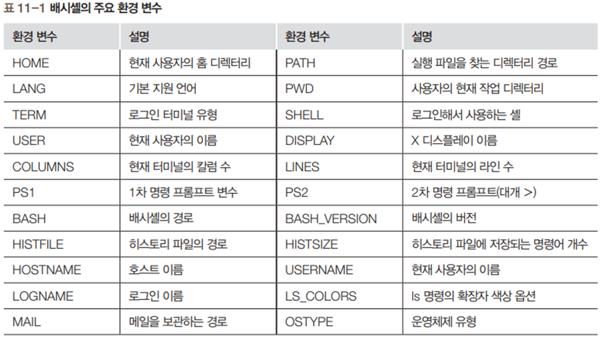

# Bash 쉘과 변수

셀 프로그래밍을 원활하게 하기 위해서는 먼저 변수에 대해서 알아 두는 것이 중요합니다. 셀의 변수는 크게 `일반변수`와 `환경변수`로 구분할 수 있습니다.


## 변수란?

변수란 데이터를 저장할 수 있는 메모리공간을 말합니다. 

* 변수는 값을 계속 변경하여 저장하는 개념


### 셀 변수의 특징

셀의 변수는 다른 언어와 달리 미리 선언을 하지 않아도 사용이 가능합니다. 

* 셸 스크립트에서는 변수를 사용하기 전에 미리 선언하지 않음. 
* 처음 변수에 값이 할당되면 자동으로 변수가 생성


또한, 데이터의 타입도 가지지 않습니다.

* 변수에 들어가는 모든 값은 문자열(string)로 취급되고 숫자를 넣어도 동일하게 취급

  > ```
  > hojin@hojin3:~/bin$ myvar=7+5
  > hojin@hojin3:~/bin$ echo $myvar
  > 7+5
  > ```


### 변수를 생성하는 방법

셀에서 변수를 생성하는 방법은 매우 간단합니다. 프롬프트에서 `변수명=값`형태로 입력해 주면 됩니다.

> 변수를 생성할 때는 `=`앞뒤에 공백이 있으면 안됩니다.
>
> ```bash
> hojin@hojin3:~$ lname = hojin
> Command 'lname' not found, did you mean:
>   command 'uname' from deb coreutils (8.32-4.1ubuntu1)
>   command 'lame' from deb lame (3.100-3build2)
> Try: sudo apt install <deb name>
> ```
>
> 위와 같이 오류가 발생됩니다.


실습을 통하여 확인해 보도록 합니다.

```bash
hojin@hojin3:~$ myname=hojin
hojin@hojin3:~$ echo $myname
hojin
```

위와 같이 간단하게 변수 생성이 가능합니다. 변수를 확인할 때는 변수명 앞에 `$` 기호를 붙여 주어 출력하면 됩니다.  


다음은 숫자값을 가지는 변수를 생성하는 방법입니다.

```bash
hojin@hojin3:~$ score=90
hojin@hojin3:~$ echo $score
90
```


### 변수명 생성 규칙

변수명은 문자, 숫자, _(언더바)로 구성합니다. 하지만, 변수명의 시작은 반드시 문자나 _로 시작되어야 합니다.

* 변수명은 대문자와 소문자를 구분

  > $aa와 $AA는 다른 변수명


### 변수의 확인

변수를 확인할때는 `echo` 명령어를 사용합니다.

```bash
echo $변수명
```


실습으로 방금 생성한 변수의 값을 확인해 봅시다.

```bash
hojin@hojin3:~$ echo $myname
hojin
```


셀에 생성되어 있는 변수의 목록을 확인할 때는 `set`명령을 실행합니다.

```bash
hojin@hojin3:~$ set
... 생략
```

 

grep 명령을 사용하여 방금 우리가 생성한 변수를 확인해 봅니다.

```bash
hojin@hojin3:~$ set | grep "score"
score=90
```


### 변수의 삭제

변수를 삭제할 때에는 `unset`명령을 사용합니다.

```bash
unset 변수명
```


실습을 통하여 확인해 봅니다.

```bash
hojin@hojin3:~$ echo $score
90
hojin@hojin3:~$ unset score
hojin@hojin3:~$ echo $score

hojin@hojin3:~$
```


## 환경변수

환경 변수란 시스템이 특별한 목적을 가지고 사용되는 변수를 말합니다. 환경변수는 동작 되는 프로그램에게 영향을 주게 됩니다.


### 환경변수 규칙

환경 변수는 일반 변수와 구별하기 위하여 대문자로 사용하는 경우가 많습니다.


### 환경변수 생성

환경변수를 생성할때에는 `export` 키워드를 같이 사용합니다.

```bash
export 변수명=값
```


실습을 통하여 확인합니다.

```bash
hojin@hojin3:~$ export MYAPP=jiny
hojin@hojin3:~$ echo $MYAPP
jiny
```


### 환경변수 확인

`env` 명령은 환경 변수를 출력합니다. 

```bash
hojin@hojin3:~$ env
```


> 또는  printenv 명령 실행


### 주요  환경변수





