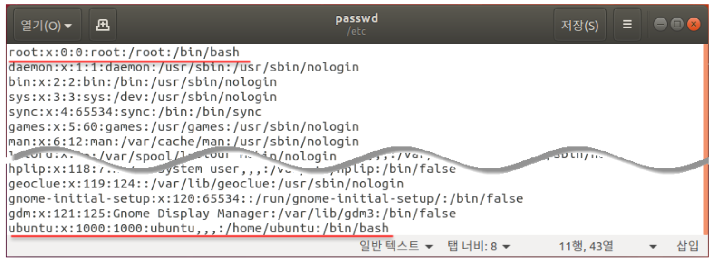

# 리눅스 시스템의 사용자 목록
리눅스는 다중 사용자 시스템을 채택하고 있습니다. 사용자의 목록은 별도의 파일에 저장하여 관리하게 됩니다. 이 파일을 통하여 어떠한 사용자들이 등록되고 관리되고 있는지 확인이 가능합니다.

## 사용자 목록 확인
리눅스에 등록된 사용자 목록은 `/etc/passwd`에 기록되어 있습니다.

* /etc/passwd 파일
* 각 행은 `사용자이름:비밀번호:사용자id:사용자 소속 그룹:추가정보:홈 디렉터리:기본셀`을 의미함




## 사용자 계정 살펴보기
`/etc/passwd` 파일안에 들어있는 자신의 계정 정보를 확인해 봅니다.

```
hojin:x:1000:1000:,,,:/home/hojin:/bin/bash
```

* 사용자이름은 `hojin`입니다. 비밀번호는 `x`로 표시 됩니다.
  > 비밀번호는 /etc/shadow 파링에 비밀번호가 지정되어 있습니다.
  >
  > ```
  > hojin@hojin3:/etc$ sudo cat /etc/shadow | grep "hojin"
  > hojin:$y$j9T$Qyt8qUunrPBPTClm4UBHB1$3PT1OLpIwtW2pNtJhzkDFPGP3Q2Lj5hy4uvdnDJo3F3:19420:0:99999:7:::
  > ```

* hojin의 사용자 id는 1000, 속한 그룹 id도 1000 입니다.
* 추가 정보로 `이름, 방 번호, 직정 전화번호, 집 전화번호, 기타`가 있으나 모두 생략됨
* 현재 사용자 이름만 hojin으로 설정
* hojin의 사용자 홈 디렉터리는 `/home/hojin`이고, 로그인시 제공되는 셀은 `/bin/bash` 이다.
* root 사용자를 살펴보면 사용자 id와 소속 그룹 id가 모두 0으로 설정되어 있음
