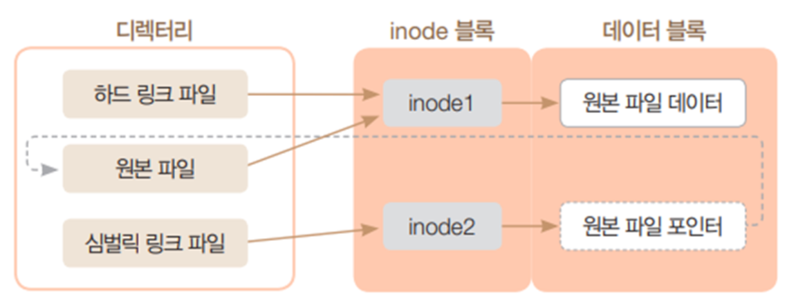
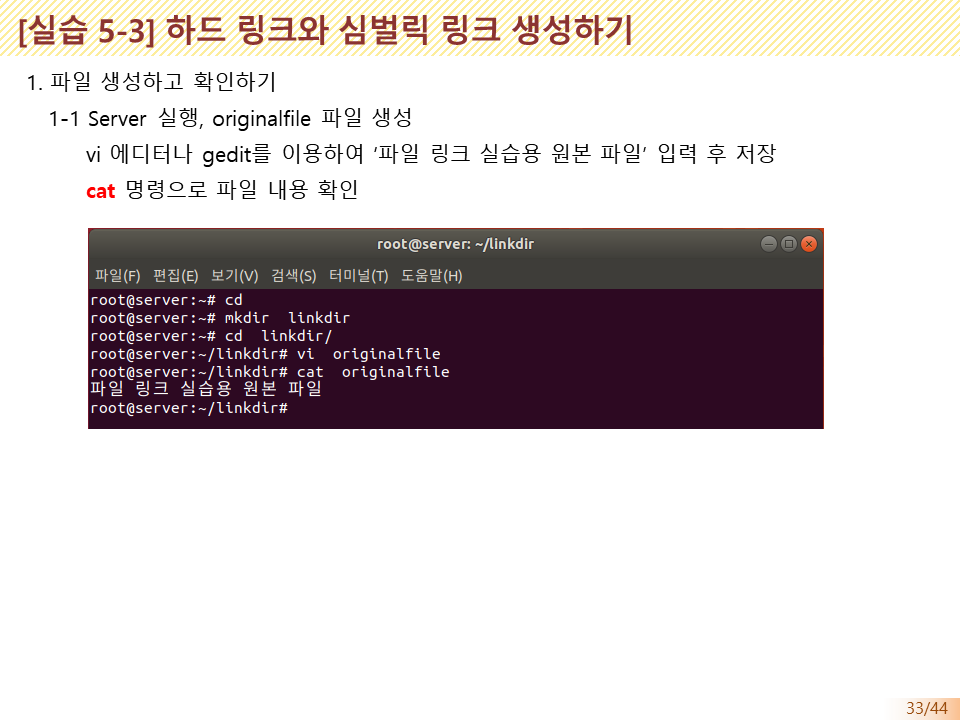
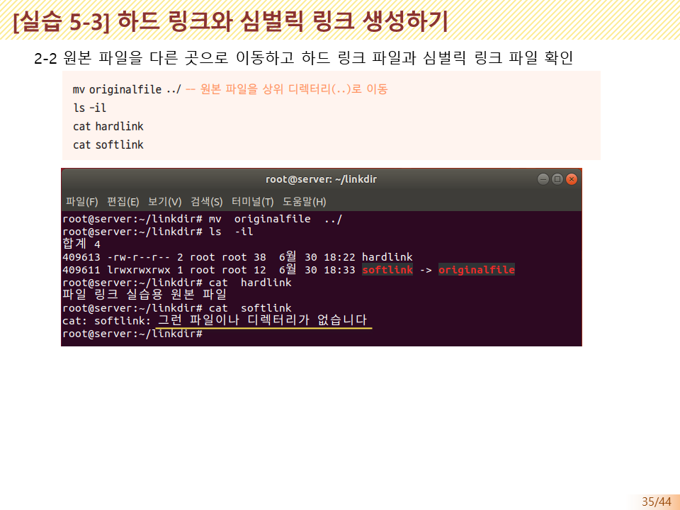

# 링크
파일의 링크는 하드 링크(hard link)와 심벌릭 링크(symbolic link) 또는 소프트 링크(soft link)로 구분됨




## 하드 링크(hard link)
하드 링크(hard link)의 두 파일명은 같은 디스크에 위치한 같은 데이터를 가리키며 다음과 같은 특징이 있다.

### 특징
* 하드 링크의 두 파일명은 같은 디스크에 위치한 같은 데이터를 가리킴.
* 하드 링크는 원본 파일과 완전히 동일하고, 부가적인 디스크 공간을 차지 하지 않음
* 하드 링크 파일은 원본과 동일하기 때문에 하드 링크 파일을 지우면 원본 도삭제됨.  
> 윈도우 운영체계에는 없는 개념


하드 링크를 생성하는 명령은 `ln` 원본파일 링크파일명

```bash
ln 원본 링크명
```

> 해당 파일 상태를 보는 명령은 `stat`


## 심벌릭 링크(symbolic link)
심볼릭 링크(symbolic link)는 원 파일을 연결해 주는 파일로 단순 링크된 파일이며 다음과 같은 특징이 있다.

### 특징
심볼릭 링크(symbolic link)는 원 파일을 연결해 주는 파일로 단순 링크된 파일이며 다음과 같은 특징이 있다.

* 심볼릭 링크는 작은 파일로 존재하며, 이 파일은 링크된 파일올 가리킴.
* 윈도우에서 바탕화면의 바로 가기 아이콘 개념. 아이콘을 지운다고 해당 파일이 지워지지는 않음


심벌릭 링크를 생성하는 명령은 `-s` 옵션을 같이 사용

```bash
ln -s 원본파일 링크파일명
```


## 하드링크와 심벌릭 링크 차이

하드링크는 inode를 그대로 가르키고 있기 때문에, 원본이 삭제되더라도 그대로 사용 가능

* 원본을 유지할 수 있는 장점

* 파악하지 못한 하드링크가 있는 경우 불필요한 저장소 낭비

* 원본이 이동되어도 사용 가능

* 심벌릭링크는 원본 이름만 같으면, 다른 파일이어도 동작.








