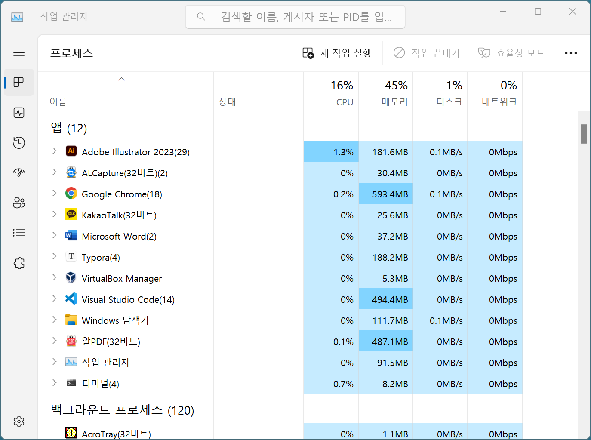

# 프로세스란?
리눅스는 운영을 위하여 여러개의 시스템 프로그램 등이 실행됩니다.


## 프로세스의 이해

운영체제는 하나의 프로그램을 실행하면서 여러개의 조각으로 분할하여 실행을 합니다. 또한, 많은 수의 프로그램이 실행될때에는 분리된 조각들의 실행이 대기와 실행을 반복하여 이루어 지게 됩니다.


이러한 프로그램의 조각들은 규칙을 가지고 실행이 되면서, 여러개의 프로그램들이 동시에 실행되는 것처럼 보이게 됩니다.


## 프로세스

프로세스(process) 는  컴퓨터 내에서 실행 중인 프로그램을 말합니다. 

* 프로세스는 `프로세스명`과 프로세스 `번호`(Process id, 약자 PID)로 표현
* 프로세스가 실행 중 자신에게 종속적인 프로세스를 두어 보조업무를 처리하
  는데, 이 두 프로세스를 부모 프로세스, 자식 프로세스라고 함.


리눅스에서 실행되고 있는 프로세스를 확인합니다.

```
ps 옵션
```

### 윈도우 운영체제의 프로세스 관리

윈도우에서도 작업관리자를 통하여 프로세스의 실행상황을 볼 수 있는데, 
이러한 개념은 유닉스, 리눅스에서의 개념으로부터 시작된 사항임. 




## 프로세스 스케줄링

운영체제는 복수의 프로그램이 동시에 실행되기 위하여 프로그램의 실행단위인 프로세스가 `일정한 규칙`에 의하여 구동되는데 이를 프로세스 `스케줄링`이라고 한다.  


### 프로세스 스케줄링

* 프로세스가 일(Job, 잡)을 실행하는 상황은 다음 그림과 같은 상태가 주기
  적으로 반복됨.
* 즉 여러 개의 잡을 `동시에 실행`하기 위하여 프로그램의 처리(프로세스, 프로세싱(processing)를 시간을 분할(Tlme Sharing) 하여 프로세스를 배분(process scheduling)함.


### 프로세스 스케줄링 상태 변화

처리되는 프로세스는 시스템의 처리 우선순위(pri ority)에 따라 잠시 정지하여 대기하거나 계속 CPU를 배분 받아 일을 처리할 수 있는 상황이 반복 되는개념


