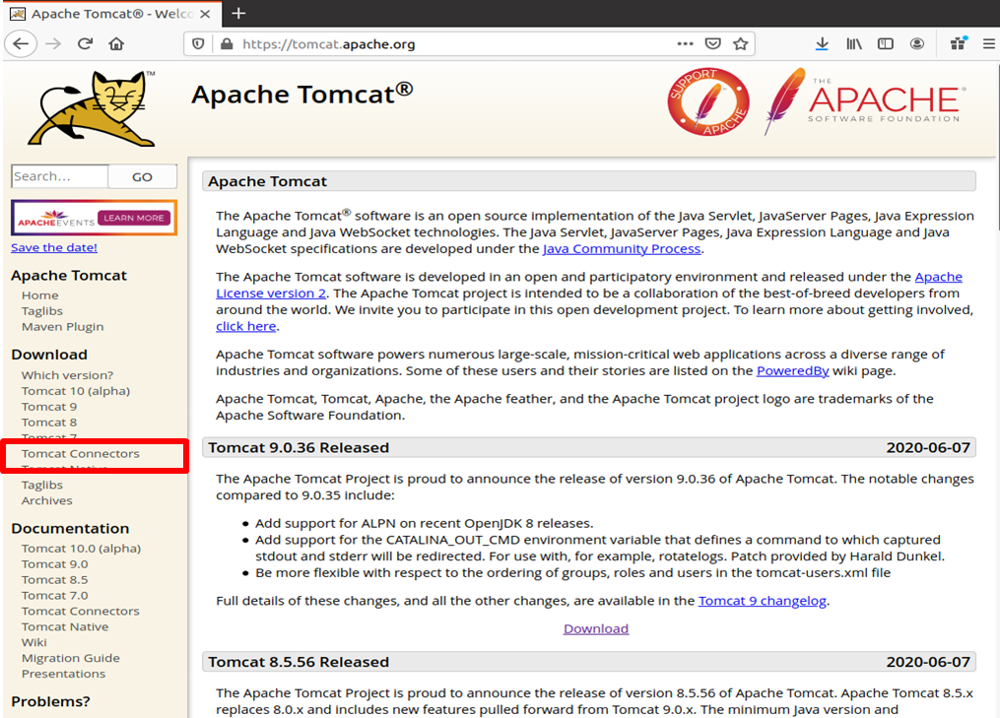

# Web server와 WAS 서버 연결
Apache와 Tomcat을 연결하는 connector 모듈이 필요합니다.


## JK Connector 
아파치가 설치된 경로의 modules 디렉터리에 mod_jk 파일을 위치시킨다.
> http.conf의 mod_jk.so 위치와 일치해야함.

### mod_jk란?
AJP프로토콜을 사용하여 톰캣과 연동하기 위해 만들어진 모듈이다. mod_jk는 톰캣 홈페이지에서 배포하고 있습니다. tomcat-connector를 다운로드 하여아파치 웹서버에 설치해주어야 합니다. 

### mod_jk connector 설치
apt 명령을 통하여 아파치-톰켓 컨넥터를 설치합니다. 
아파치가 설치된 경로의 Modules 디렉터리에 mod_jk 파일을 설치합니다. 
```bash
sudo apt install libapache2-mod-jk*
```

또는 공식사이트에서 다운로드 받아 설치할 수도 있습니다.




## 아파치 설정

### workers.properties 파일 수정
apache-tomcat의 connector에 tomcat 서버들의 별명을 지어주고, 정보를 설정주어야 합니다. 

- Connector 설정 파일인 `/etc/libapache2-mod-jk/workers.properties` 입니다.

편집기를 통하여 workers.properties에 연동할 톰캣의 정보 (host, port, lbfactor (작업할당량) 등)를 수정합니다.  

```bash
sudo vi /etc/libapache2-mod-jk/workers.properties
```
`tomcat9 home`과 `java home` 위치를 지정합니다.
```
# workers.tomcat_home should point to the location where you
# installed tomcat. This is where you have your conf, webapps and lib
# directories.
#
workers.tomcat_home=/usr/share/tomcat9

# workers.java_home should point to your Java installation. Normally
# you should have a bin and lib directories beneath it.
#
workers.java_home=/usr/lib/jvm/default-java
```


톰캣이 여러대인 경우 workers.list의 각 worker이름을 설정합니다.
```
# The workers that your plugins should create and work with
#
worker.list=ajp13_worker
```

예를 들면 webmail, sysman, mobile등 있는 경우.
```
# worker.list=webmail, sysman, mobile  // 이름은 임의로 설정
```

- Tomcat의 `home directory`, `port`, `통신 protocol`등을 설정합니다.

tomcat 별칭 설정
```
worker.webmail.type=ajp13 
worker.webmail.host=localhost
worker.webmail.port=8009 //포트번호. 톰캣에서 설정한 포트와 일치해야함
worker.webmail.lbfactor=1 //서버밸런스 비율 


worker.sysman.type=ajp13
worker.sysman.host=localhost
worker.sysman.port=8019 // 포트중첩 불가. 

worker.mobile.type=ajp13
worker.mobile.host=localhost
worker.mobile.port=8019 // 포트중첩 불가. 
```


### http.conf
연동할 톰캣의 정보를 가진 properties파일은 생성 했으면 아파치가 실행할때 참조하는 httpd.conf파일에 이를 명시해주어야한다.

webserver apache에 apache-tomcat connector에 설정된 tomcat 으로 요청을 보내도록 설정합니다. (별명 사용)
- /etc/apache2/sites-available/000-default.conf


```bash
sudo vi /etc/apache2/sites-available/000-default.conf  
```

서버이름을 설정합니다. 주석을 제거하고 로컬호스트의 주소로 설정합니다.
```
ServerName 127.0.0.1
``` 

DocumentRoot 아래 `JKMount`설정을 합니다.
```
DocumentRoot /var/www/html
JKMount /* ajp13_worker
```

* JkMount란?
이 부분에서 어떤 URL로 오는 경우, 어떤 worker(톰캣)가 처리할 지 결정할지 설정한다.

JkMount 뒤에 오는 /* 는 모든 url의 요청을 의미한다.

즉, 모든 url의 요청에서 서블릿 관련처리가 필요하다면, workers.properties파일에 명시된 worker(WAS)에게로 넘기겠다. 라는 의미가 된다. 


### httpd-jk.conf 
- /etc/apache2/mods-available/httpd-jk.conf

```bash
sudovi /etc/libapache2-mod-jk/httpd-jk.conf  
```


다음 내용을 추가합니다.
```
LoadModule jk_module /usr/lib/apache2/modules/mod_jk.so
# mod_jk.so의 위치

JkWorkersFile /etc/libapache2-mod-jk/workers.properties
# workers 설정 파일 위치

JkLogFile /var/log/apache2/mod_jk.log
# 로그파일 위치

JkLogLevel info

## JKShmFile /var/log/apache2/jk-runtime-status
JkShmFile /etc/apache2/logs/mod_jk.shm
# Load balancing workers will not function properly 오류 대응, httpd의 권한


# URL에 따른 요청 처리 설정
# JkMount /*.jsp webmail
# JkMount /*.do webmail
# JkMount /sysman/* sysman
# JkMount /mobile/* mobile
```

### jk.load
mod_jk.so 위치를 설정합니다.
- /etc/apache2/mods-available/jk.load (없으면 만든다.)

```bash
sudo vi /etc/apache2/mods-available/jk.load
```

### 톰캣 server.xml 
WAS tomcat에 특정 port와 특정 protocol로 오는 요청을 받으라라는 동작을 설정

- Tomcat 설정 파일 -  `/etc/tomcat9/server.xml`

웹서비스는 아파치의 기본 포트인 `:80`으로 접속을 하여 처리하게 됩니다. 따라서 톰켓으로 직접 접속 가능한 `:8080`포트는 접속을 하지 못하도록 이를 방지합니다.

```bash
hojin@hojin3:~$ sudo vi /etc/tomcat9/server.xml   
```

다음과 같이 주석을 통하여 기존의 HTTP 커넥터에서 8080 포트를 제거합니다.
```
<!--
<Connector port="8080" protocol="HTTP/1.1"
               connectionTimeout="20000"
               redirectPort="8443" />
-->
```


AJP 커넥터 설정을 합니다.
- AJP1.3으로 연결되고 port 8009로 요청이 들어올 것임을 설정
- Deploy할 app 위치 - /var/lib/tomcat9/webapps

다은 부분을 찾아서 주석을 해제 합니다.  

```xml
<!-- Define an AJP 1.3 Connector on port 8009 -->
<!--
<Connector protocol="AJP/1.3"
            address="::1"
            port="8009"
            redirectPort="8443" />
-->
```

컨넥터 설정을 다음과 같이 변경해 줍니다.
```xml
<Connector protocol="AJP/1.3" address="0.0.0.0" port="8009" redirectPort="8443" packetsize="65536" secretRequired="false"/>
```

이 ajp커넥터에 등록한 정보와 아파치 workers.properties의 정보가 일치해야 통신이 가능하다.

### AJP란? Apache JServ Protocol 
웹서버 뒤에 있는 와스로 부터 웹서버에서 받은 요청을 와스로 전달해주는 프로토콜이다. 

아파치와 톰캣을 연동하기 위해서는  AJP를 통해 서로 통신을 한다.

아파치는 이를 사용하여 80포트로 들어오는 요청은 자신이 받고, 이 요청중 서블릿을 필요로 하는 요청은 톰캣에게 전달하여 처리한다. (httpd.conf 의 JkMount설정 )

해당 프로토콜(ajp)는 다양한 WAS에서 지원한다. ex) 아파치, 톰캣, 제우스, 웹로직, 웹스피어 등..

## 재시작
아파치-톰켓 연동 설정을 적용하기 위해서는 각각 재시동을 해야 합니다.

```bash
hojin@hojin3:~$ sudo service tomcat9 restart
hojin@hojin3:~$ sudo service apache2 restart
```


## 연동 확인
Localhost:8080으로 들어갔을때와 localhost로 들어간 경우 동일한 화면이 나옴이 확인되면 `정상동작`이다.  

### 아파치 80 접속 확인 
* 8080 포트 없이 접속되는지 확인한다. 
* 연동 전에는 포트 번호를 붙여야 하지만, 이후에는 포트 번호 없이 접속이 가능하다. 


### Apache와 Tomcat이 다른 server에 있는 경우는?
> Tomcat의 host를 나타내는 ip를 127.0.0.1(or localhost)에서 tomcat서버의 ip로 변경한다.  

Tomcat 에서 8080 말고 웹에서 다른 port로 접속할수 있나요?  

https://localhost하면 연결이 안될때는?  
> netstat -ntlp => 8080 이 열려있는가? 확인한다.
> Tomcat 구동중인지 status를 확인한다.


## 여러개의 was
apache-tomcat connector 설정합니다.

* /etc/libapache2-mod-jk/workers-properties (설치시 자동 생성됨)

* tomcat9 home과 java home 을 변경

```
# /etc//workers-propertieslibapache2-mod-jk

workers.tomcat_home=/var/lib/tomcat9
workers.java_home=/usr/lib/jvm/default-java

worker.list=ajp13_worker,hj_worker,hj,tomcat1
worker.ajp13_worker.port=8009
worker.ajp13_worker.host=127.0.0.1
worker.ajp13_worker.type=ajp13 

worker.hj_worker.port=8009 (해당 port)
worker.hj_worker.host=ip1 (해당 ip)
worker.hj_worker.type=ajp13 

```


